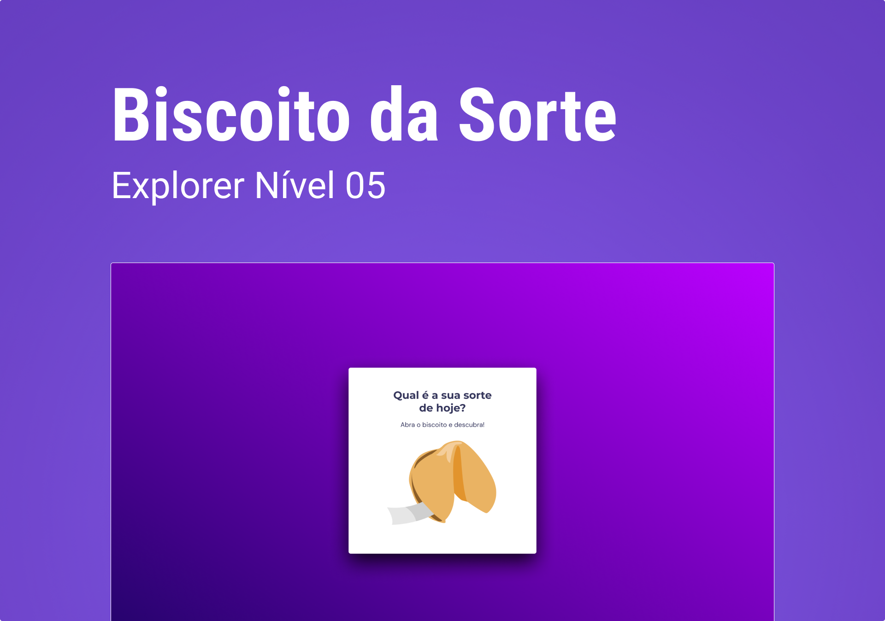

<div align="center">
  
  <h2 align="center">Biscoito da sorte</h2>

</div>

<br/>

### Demo Screeshots



### About

In this challenge, a game called Lucky Cookie was created, in which the user, from a click or enter, opens a cookie with his luck of the day. The concepts were applied:

- HTML data structure
- Animations with CSS
- Functions in Javascript
- DOM manipulation
- JS Math() library
- *callback* functions
- Arrays

### Prerequisites

Before you begin, ensure you have met the following requirements:

- [Git](https://git-scm.com/downloads "Download Git") must be installed on your operating system.

### Run Locally

To run **Biscoito da sorte** locally, run this command on your git bash:

Linux and macOS:

```bash
sudo git clone https://github.com/denilsonbaptista/biscoito-da-sorte.git
```

Windows:

```bash
git clone https://github.com/denilsonbaptista/biscoito-da-sorte.git
```

### Contact

If you want to contact with me you can reach me at [Linkedin](https://www.linkedin.com/in/denilsonbaptista/).

### License

This project is **free to use** and does not contains any license.